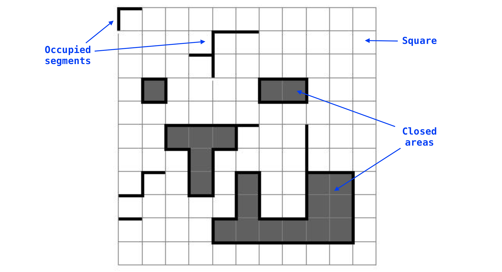
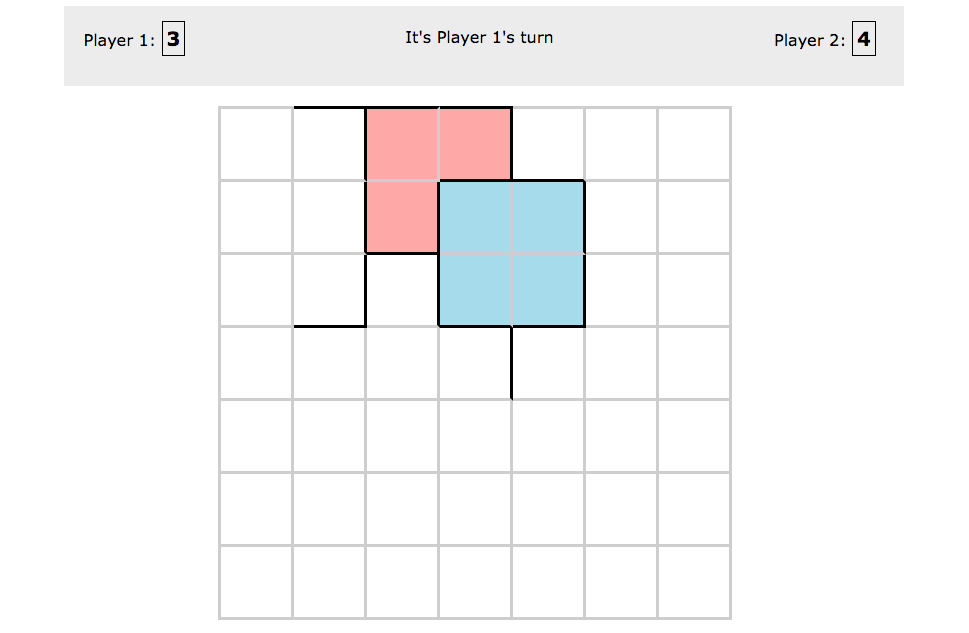
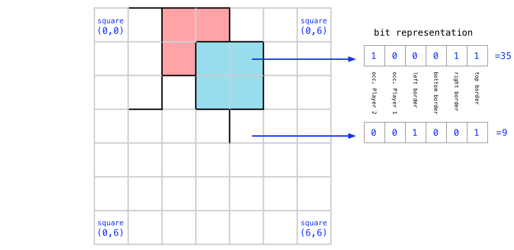

# Assignment 10 - Circuit Wars

Your task is to program a simple AI to play a game called *Circuit Wars*.  The rules of the game are detailed below.

You may complete this assignment **individually or in teams of max 3 people**.

If you work in teams, then **only one of the team members should submit the solution on GitHub**. Create a `team.md` file that lists all the student numbers that are part of the team.

To pass the assignment, your program should be capable of playing a full game from registering until all segments on the board become occupied, without prematurely ending the game with an illegal move or a timeout. There is no requirement on winning the game to get the assignment approved.

Each delivery that is approved automatically enters the championship. The winning team of the championship will get 10 bonus points and the runner-up team will get 5 bonus points at the final exam (the points are for each team member).

There is no possibility of a revision on this assignment.

There will be no Norwegian translation for this assignment.


## Objective

The objective of the game is to occupy the largest possible territory on a given circuit board.


## Definitions

  * A *circuit board* is represented by a square grid of a given size. To simplify things, we use a fixed size board of 7x7.
  * A *square* is the smallest area on the board enclosed by gridlines.  
    - The upper left square of the board is represented by the (0, 0) coordinates, the lower right square is represented by the (n-1, n-1) coordinates, where n is the size of the board. In the (x,y) coordinate pair, x advances from left to right, while y advances from top to bottom.
  * A *segment* is a line connecting two neighboring grid points, i.e., any border of any square.
    - Hence, any segment on the board can be represented as a coordinate triple *(x, y, border)*, where *x* and *y* are the coordinates of the given square, and *border* is one of the following elements: top, right, bottom, left.
    - Note: this logical representation is redundant. E.g., the following borders are identical: *(x, y, top)* and *(x, y-1, bottom)*, *(x, y, right)* and *(x+1, y, left)*, etc.
  * During the flow of the game, for every turn the two players will select a *free segment* on the board. Once a given side of a given *square* is *occupied* (selected) by any of the players, it will remain occupied until the end of the game, hence it will not count as a free side of that square. At the start of the game every segment is free, including those on the board’s boundaries.
  * An *area* is an interconnected set of neighboring squares on the board.
  * An *occupied area* is an area that has a continuous chain of occupied segments around its borders.




## Rules

  * A game session starts when two players (client programs) successfully register in the game server.
  * A game is composed of alternate turns of the players, until one of the "end of game conditions" is met.
  * In each turn, a player occupies one of the free segments ("borders") on the board.
  * If the given segment creates a new closed area on the board, the squares in that closed area will increase the player's score, each square counting 1 point. If a new closed area is created during a turn, all borders of all squares within the closed area automatically become occupied. Therefore, even if no player occupied them previously, segments within a closed area will not count as valid steps for the rest of the game.
  * A program's turn ends (i.e. the other player will continue with its turn), if any of the following conditions are met:
    - The program sends a valid move to the server.
    - The time limit is reached for the given turn.
    - The program presented an invalid segment (occupied or out of the table boundaries), or violated the communication protocol in any way. (If this happens, it automatically implicates the end of game as well.)
  * For each turn, there is a time limit of 3 seconds, within which the oncoming program should present a valid step, otherwise a timeout event will occur and the game will end immediately.
  * The game will continue turn by turn, until one of the following conditions is met:
    - There are no more available free segments on the board. In that case the winner of the game is the program that has the higher score. Note: as the size of the board is odd, there is no possibility of achieving a draw.
    - One of the programs had a timeout event. In that case, the other program automatically wins.
    - One of the programs sends an invalid step to the server or violates the communication protocol. In that case, the other program automatically wins.


## Communication protocol

You can start the server by running `game_server.py` under the `cw` folder. The same server program will be used for testing your delivery and for the championship. We will assume that the server is always running at `http://127.0.0.1:5000/` (so make sure no other program occupies that port).

This server program has three routes that can be accessed as GET requests:

  * The `/status` route can be used to request the current status of the game. It returns a JSON object with the following fields:
    - `status_code`: the status code (see the table below for the list of possible statuses)
    - `status`: the corresponding status text
    - `score_1`: score of Player 1
    - `score_2`: score of Player 2  
    - `time_left`: -1 if the game has not yet started or has finished, otherwise the time left for the current player to move (in milliseconds)
    - `last_move`: if the game is already underway, it contains the last *valid move* (in `x,y,border` format); otherwise, it is empty.
    - `board_size`: the size of the board
    - `board`: the current status of the board.  The board is represented as a 2-dimensional (nested) array, where the first dimension corresponds to the row index *y* and the second dimension corresponds to the column index *x*. Each value corresponds to a square, using the data representation explained below.
    - For example, this status corresponds to the figure below.
    ```
    {
      {
        "status_code": 201,
        "status": "It's Player 1's turn",
        "score_1": 3,
        "score_2": 4,
        "time_left": 3000,
        "board_size": 7,
        "last_move": "4,0,bottom",
        "board": [
          [0, 3, 25, 23, 12, 0, 0],
          [0, 2, 30, 41, 35, 8, 0],
          [0, 6, 11, 44, 38, 8, 0],
          [0, 1, 0, 3, 9, 0, 0],
          [0, 0, 0, 0, 0, 0, 0],
          [0, 0, 0, 0, 0, 0, 0],
          [0, 0, 0, 0, 0, 0, 0]
        ]
      }
    }
    ```



  * The `/reg/<team_id>` request it to be called only once, to register your team. The value of team_id can be an alphanumerical string, at most 10 characters long.
    - If the registration is successful, you will get a JSON object back with response OK and whether you are Player 1 or 2. E.g.,
    ```
    {
        response: "OK",
        player: 1
    }
    ```
    - If the registration is unsuccessful, you will get back response ERROR and an error code. See below for the list of possible error codes.  If the error code is not `3`, then you can make a new registration request. E.g.,
    ```
    {
        response: "ERROR",
        error_code: 2
    }
    ```
    - As soon as both teams successfully registered, the game will automatically start. (This means that after you have received an OK response, you should start periodically requesting the status.)
  * The `/move/<team_id>/<x,y,border>` route is to be used to make a move. The move is a triple with the *x* (0..6) and *y* (0..6) coordinates of the square and the side where you want to add a border; *border* can take `left`, `right`, `top`, and `bottom` as values.  In response, you will get back the current status of the game.
    - For example, `/move/myTeam/1,2,top` will add a top border to the square at the `(1,2)` position.
    -  If your move was valid, then you will get back status_code `201` or `202` (depending on which player's turn it is next), or `301` or `302`, if that was the last move and the game has ended.
    - If it is not your turn to make a move or your move cannot be parsed, then it counts as an illegal move.  In this case, you will get back `401` or `402`, and the game will not continue.
    - If your move was sent too late (you timed out), then you will see `501` or `502` as the status_code and the game terminates.


### Square representation

Each square is represented as a 6-bit number.  The lower 4 bits corresponds to borders on each side of the square,
specifically, the 1st, 2nd, 3rd, and 4th bits (from "right to left") correspond to top, right, bottom, and left borders, respectively.  The higher two bits correspond to whether the square has been occupied by Player 1 (5th bit) or Player 2 (6th bit). Note that only one of the 5th and 6th bits may be True.  If a square has not been occupied, then both the 5th and 6th bits are False.




### Status codes

| Status_code | Description |
| --- | --- |
| 100 | The game has not started yet (waiting for both players) |
| 101 | The game has not started yet (waiting for the second player) |
| 201 | It's Player 1's turn |
| 202 | It's Player 2's turn |
| 301 | The game has finished, Player 1 won |
| 302 | The game has finished, Player 2 won |
| 401 | The game has ended because of an illegal move by Player 1 |
| 402 | The game has ended because of an illegal move by Player 2 |
| 501 | The game has ended because of time-out by Player 1 |
| 502 | The game has ended because of time-out by Player 2 |

### Error codes

| Error_code | Description |
| --- | --- |
| 1 | Invalid team_id |
| 2 | This team_id has already been taken by another player |
| 3 | You cannot join, the game has already started |


## Tools

You are given some tools to help you develop your game AI.
Make sure the server is running, before using these.

  * The game server comes in a built-in graphical interface for monitoring the status of the game. It is available at http://127.0.0.1:5000/.
    - The related code is under `cw/static`. All this page does is that it makes a GET request at every 0.2 sec to `/status` using jQuery, and then updates the board, scores, and status text on the page.
    - Mind that using http://localhost:5000 in the browser won't work (because the code would violate the same-origin principle). You either need to use http://127.0.0.1:5000/ or update the `SERVER` variable to localhost in `cw/static/game.js`.
  * `test.py` is a test script that makes a simple (fixed) sequence of moves on behalf of both players. To get started with this assignment, you might want to load the game monitor in a browser, then run `test.py` to see what happens.

Some notes for development:

  * You can turn off the timeout for the server by setting `TIMEOUT=-1` in `cw/game.py`. Bear in mind that we will be using a 3sec timeout for testing your program as well as during the Championship.
  * The server also has a `/restart` "service" route which you can call to reset the game to the initial state.  This route is strictly to be used during development.


## Game AI

You need to implement your game AI in `game_ai.py`.  This is the only file where you need to make changes, and submit it on GitHub.

Some initial code is already provided that registers itself (using a fixed team_id) and is then makes some (random) moves.

Notes:

  * You need to make sure that your client can register itself in case the other team has chosen the same team_id.
  * You are free to make any changes to this code, but make sure that your client can be run as `python game_ai.py` using Python 3.5.
  * You need to wait at least 0.2sec between making consecutive requests (this is already implemented).
  * You can reuse the `Board` class from the server if you want to.


## Championship

  * The qualifying teams will compete each other in a championship tournament using a knockout format.
    - Depending on the number of teams, there might be an additional group stage.
  * Each pair of teams will play against each other twice (so that each team gets to play both as Player 1 and as Player 2).
  * In case of a tie, the better overall score ratio counts.
